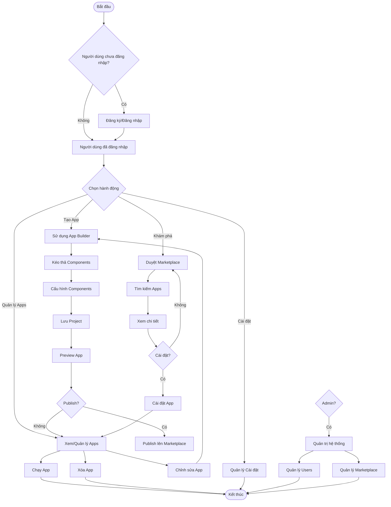
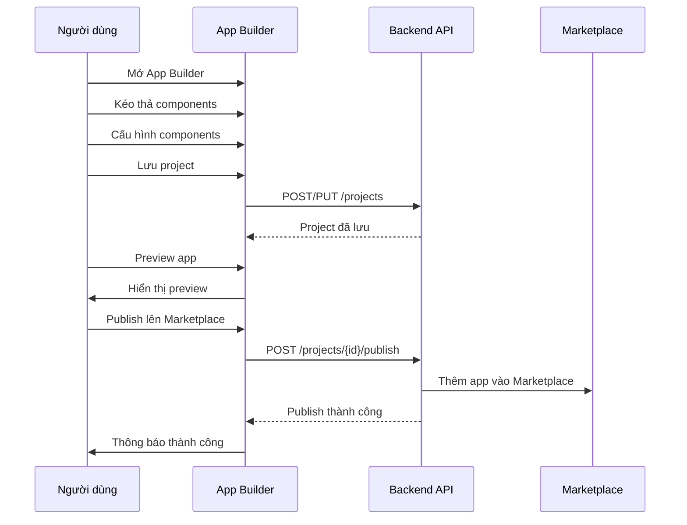
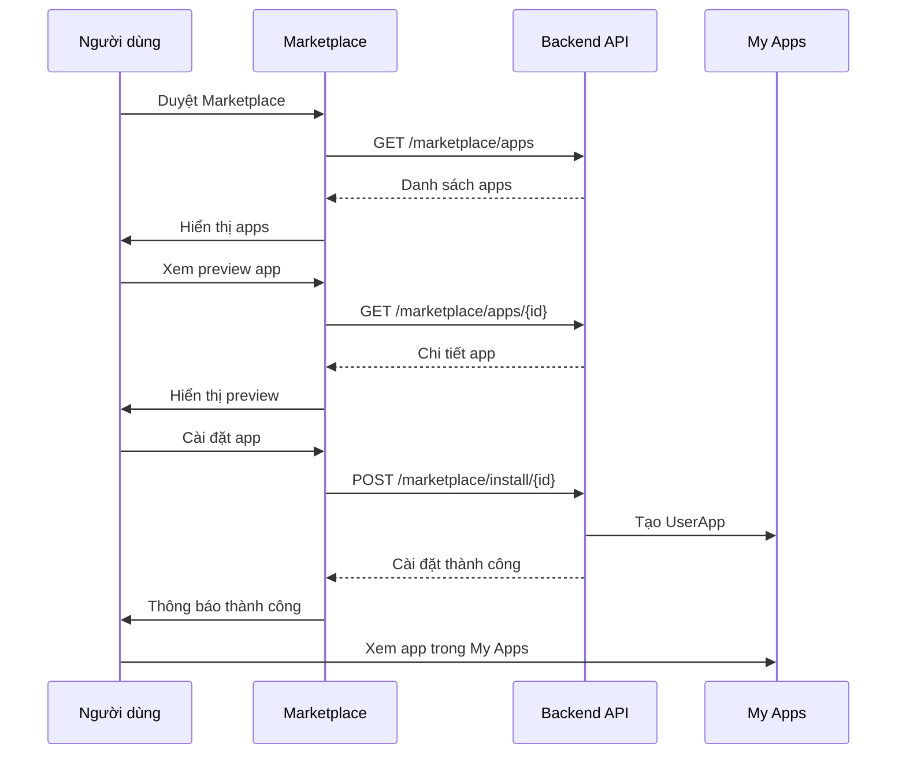
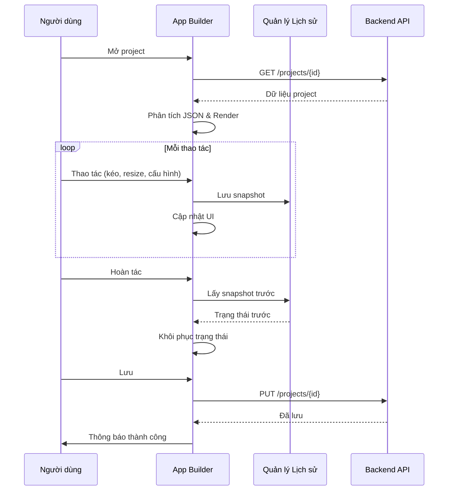
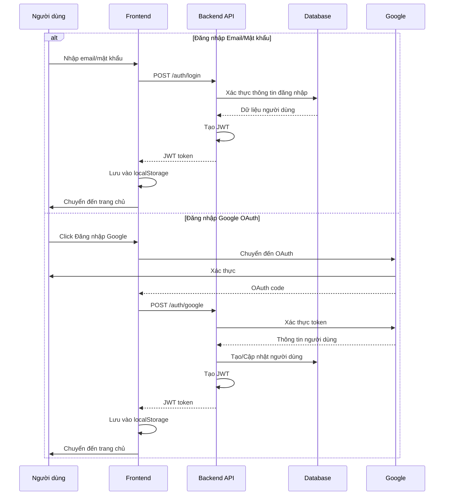

# Tổng hợp Chức năng & Use Cases - NEXUS-403

Tài liệu này tổng hợp tất cả các chức năng trong dự án NEXUS-403 theo từng trang, kèm sơ đồ use case chi tiết.

---

## Mục lục

1. [Tổng quan hệ thống](#1-tổng-quan-hệ-thống)
2. [Use Case tổng quát](#2-use-case-tổng-quát)
3. [Danh sách các trang và chức năng](#3-danh-sách-các-trang-và-chức-năng)
4. [Use Cases theo từng trang](#4-use-cases-theo-từng-trang)
5. [Use Case tổng hợp](#5-use-case-tổng-hợp)
6. [Luồng hoạt động chính](#6-luồng-hoạt-động-chính)

---

## 1. Tổng quan hệ thống

**NEXUS-403** là một nền tảng no-code/low-code cho phép người dùng:
- Tạo ứng dụng web bằng cách kéo thả components (App Builder)
- Chia sẻ và cài đặt ứng dụng từ Marketplace
- Quản lý ứng dụng của mình (My Apps)
- Chạy ứng dụng ở chế độ runtime

**Kiến trúc:**
- **Frontend**: React (Vite), TailwindCSS
- **Backend**: ASP.NET Core 9.0
- **Database**: MongoDB Atlas (business data), SQL Server (user identity)
- **Authentication**: JWT, Google OAuth 2.0

**Actors (Tác nhân):**
- **Guest User**: Người dùng chưa đăng nhập
- **Authenticated User**: Người dùng đã đăng nhập
- **Admin**: Quản trị viên hệ thống

---

## 2. Use Case tổng quát

Phần này mô tả các use case ở mức tổng quát, thể hiện các chức năng chính của hệ thống NEXUS-403 và mối quan hệ giữa các actors với các chức năng đó.

### 2.1. Sơ đồ Use Case tổng quát

```mermaid
usecaseDiagram
    actor Guest as "Người dùng chưa đăng nhập"
    actor User as "Người dùng đã đăng nhập"
    actor Admin as "Quản trị viên"
    
    %% Nhóm: Xác thực và Phân quyền
    package "Xác thực và Phân quyền" {
        Guest --> (Đăng ký tài khoản)
        Guest --> (Đăng nhập)
        User --> (Đăng xuất)
        User --> (Quản lý tài khoản)
    }
    
    %% Nhóm: Quản lý Ứng dụng
    package "Quản lý Ứng dụng" {
        User --> (Tạo ứng dụng)
        User --> (Chỉnh sửa ứng dụng)
        User --> (Xóa ứng dụng)
        User --> (Xem danh sách ứng dụng)
        User --> (Chạy ứng dụng)
    }
    
    %% Nhóm: App Builder
    package "App Builder" {
        User --> (Sử dụng App Builder)
        (Sử dụng App Builder) --> (Kéo thả components)
        (Sử dụng App Builder) --> (Cấu hình components)
        (Sử dụng App Builder) --> (Lưu project)
        (Sử dụng App Builder) --> (Preview ứng dụng)
    }
    
    %% Nhóm: Marketplace
    package "Marketplace" {
        User --> (Duyệt Marketplace)
        User --> (Tìm kiếm ứng dụng)
        User --> (Xem chi tiết ứng dụng)
        User --> (Preview ứng dụng)
        User --> (Cài đặt ứng dụng)
        User --> (Publish ứng dụng)
    }
    
    %% Nhóm: Quản trị hệ thống
    package "Quản trị hệ thống" {
        Admin --> (Quản lý người dùng)
        Admin --> (Quản lý Marketplace)
        Admin --> (Quản lý Categories)
        Admin --> (Xem báo cáo hệ thống)
    }
    
    %% Nhóm: Cài đặt
    package "Cài đặt" {
        User --> (Quản lý cài đặt)
        User --> (Kết nối dịch vụ bên thứ ba)
    }
    
    %% Mối quan hệ
    (Đăng nhập) ..> (Tạo ứng dụng) : yêu cầu
    (Tạo ứng dụng) ..> (Sử dụng App Builder) : sử dụng
    (Publish ứng dụng) ..> (Duyệt Marketplace) : ảnh hưởng
    (Cài đặt ứng dụng) ..> (Xem danh sách ứng dụng) : thêm vào
    (Chạy ứng dụng) ..> (Xem danh sách ứng dụng) : mở từ
```

### 2.2. Mô tả các nhóm chức năng chính

#### **A. Xác thực và Phân quyền**
Hệ thống hỗ trợ đăng ký và đăng nhập cho người dùng mới, với hai phương thức:
- **Đăng ký tài khoản**: Người dùng tạo tài khoản mới với email và mật khẩu
- **Đăng nhập**: Người dùng có thể đăng nhập bằng email/mật khẩu hoặc Google OAuth
- **Quản lý tài khoản**: Người dùng đã đăng nhập có thể quản lý thông tin tài khoản và cài đặt

#### **B. Quản lý Ứng dụng**
Người dùng có thể quản lý vòng đời của ứng dụng:
- **Tạo ứng dụng**: Tạo ứng dụng mới thông qua App Builder
- **Chỉnh sửa ứng dụng**: Sửa đổi ứng dụng đã tạo
- **Xóa ứng dụng**: Xóa ứng dụng không cần thiết
- **Xem danh sách ứng dụng**: Xem tất cả ứng dụng đã tạo hoặc đã cài đặt
- **Chạy ứng dụng**: Mở và sử dụng ứng dụng ở chế độ runtime

#### **C. App Builder**
Công cụ no-code để tạo ứng dụng bằng cách kéo thả:
- **Kéo thả components**: Sử dụng các components có sẵn từ toolbox
- **Cấu hình components**: Thiết lập props và style cho từng component
- **Lưu project**: Lưu trữ project với khả năng auto-save
- **Preview ứng dụng**: Xem trước ứng dụng trước khi publish

#### **D. Marketplace**
Nền tảng chia sẻ và khám phá ứng dụng:
- **Duyệt Marketplace**: Xem danh sách các ứng dụng có sẵn
- **Tìm kiếm ứng dụng**: Tìm kiếm ứng dụng theo tên, category
- **Xem chi tiết ứng dụng**: Xem thông tin chi tiết về ứng dụng
- **Preview ứng dụng**: Xem trước ứng dụng ở chế độ read-only
- **Cài đặt ứng dụng**: Cài đặt ứng dụng vào workspace của người dùng
- **Publish ứng dụng**: Chia sẻ ứng dụng lên Marketplace

#### **E. Quản trị hệ thống**
Dành cho quản trị viên để quản lý toàn bộ hệ thống:
- **Quản lý người dùng**: Xem, khóa/mở khóa, xóa người dùng
- **Quản lý Marketplace**: Quản lý các ứng dụng trên Marketplace
- **Quản lý Categories**: Tạo, sửa, xóa categories cho Marketplace
- **Xem báo cáo hệ thống**: Theo dõi hoạt động và thống kê hệ thống

#### **F. Cài đặt**
Người dùng có thể cấu hình các tùy chọn:
- **Quản lý cài đặt**: Cấu hình các tùy chọn cá nhân
- **Kết nối dịch vụ bên thứ ba**: Kết nối với các dịch vụ như Google Calendar

### 2.3. Luồng hoạt động tổng quát



### 2.4. Ma trận Use Case - Actor

| Use Case | Guest User | Authenticated User | Admin |
|----------|------------|---------------------|-------|
| Đăng ký tài khoản | ✓ | - | - |
| Đăng nhập | ✓ | - | - |
| Đăng xuất | - | ✓ | ✓ |
| Tạo ứng dụng | - | ✓ | ✓ |
| Chỉnh sửa ứng dụng | - | ✓ | ✓ |
| Xóa ứng dụng | - | ✓ | ✓ |
| Xem danh sách ứng dụng | - | ✓ | ✓ |
| Chạy ứng dụng | - | ✓ | ✓ |
| Sử dụng App Builder | - | ✓ | ✓ |
| Duyệt Marketplace | - | ✓ | ✓ |
| Tìm kiếm ứng dụng | - | ✓ | ✓ |
| Cài đặt ứng dụng | - | ✓ | ✓ |
| Publish ứng dụng | - | ✓ | ✓ |
| Quản lý người dùng | - | - | ✓ |
| Quản lý Marketplace | - | - | ✓ |
| Quản lý Categories | - | - | ✓ |
| Quản lý cài đặt | - | ✓ | ✓ |

**Chú thích:**
- ✓: Có quyền thực hiện
- -: Không có quyền thực hiện

---

## 3. Danh sách các trang và chức năng

### 2.1. Trang công khai (Public Pages)

#### **LoginPage** (`/login`)
**Chức năng:**
- Đăng nhập bằng email/password
- Đăng nhập bằng Google OAuth
- Xử lý lỗi đăng nhập
- Chuyển hướng sau khi đăng nhập thành công

#### **RegisterPage** (`/register`)
**Chức năng:**
- Đăng ký tài khoản mới
- Xác thực thông tin đăng ký
- Chuyển hướng đến trang đăng nhập sau khi đăng ký

---

### 2.2. Trang người dùng (User Pages)

#### **MyAppPage** (`/`) - Trang chủ
**Chức năng:**
- Hiển thị danh sách tất cả apps của user (đã tạo hoặc đã cài)
- Tìm kiếm apps theo tên
- Lọc apps theo trạng thái (Published/Draft)
- Xem preview app (mini preview)
- Mở app ở chế độ runtime
- Chỉnh sửa app trong App Builder
- Xóa app
- Tạo app mới
- Chuyển đến Marketplace
- Chuyển đến App Builder

#### **AppBuilderListPage** (`/app-builder`)
**Chức năng:**
- Hiển thị danh sách tất cả projects trong App Builder
- Tìm kiếm projects
- Chuyển đổi view (Grid/List)
- Tạo project mới
- Chỉnh sửa project
- Xóa project
- Xem thông tin project (tên, mô tả, ngày tạo, trạng thái)

#### **AppBuilderPage** (`/app-builder/new`, `/app-builder/:projectId`)
**Chức năng:**
- Tạo project mới hoặc chỉnh sửa project hiện có
- Kéo thả components từ Toolbox vào Canvas
- Di chuyển và resize components trên Canvas
- Cấu hình props và style cho components
- Undo/Redo (lịch sử thay đổi)
- Preview app (mở ở chế độ runtime)
- Lưu project (auto-save và manual save)
- Publish project lên Marketplace
- Quản lý layout components (Container, Row, Grid)
- Quản lý control components (Button, Input, Checkbox, etc.)
- Quản lý data components (Database, ViewSwitcher, FilterBar, etc.)

#### **AppRuntimePage** (`/app/:projectId`)
**Chức năng:**
- Hiển thị app ở chế độ runtime (tương tác đầy đủ)
- Render tất cả components từ JSON data
- Xử lý events (click, input, submit, etc.)
- Toggle fullscreen
- Ẩn/hiện header
- Quay lại App Builder để chỉnh sửa
- Quay về trang chủ

#### **MarketplacePage** (`/marketplace`)
**Chức năng:**
- Duyệt danh sách apps trên Marketplace
- Tìm kiếm apps
- Lọc apps theo category
- Xem chi tiết app (modal)
- Preview app (read-only)
- Cài đặt app vào My Apps
- Xem apps đã cài
- **Admin**: Tạo/sửa/xóa categories
- **Admin**: Quản lý apps trên Marketplace (approve/reject/delete)

#### **MarketplacePreviewPage** (`/marketplace/preview/:appId`)
**Chức năng:**
- Xem preview app từ Marketplace (read-only)
- Hiển thị thông tin app (tên, mô tả, category, author, price)
- Cài đặt app (nếu chưa cài)
- Quay lại Marketplace

#### **SettingsPage** (`/settings`)
**Chức năng:**
- Kết nối/ngắt kết nối Google Calendar
- Kiểm tra trạng thái kết nối Google Calendar
- Xử lý OAuth callback từ Google
- Hiển thị thông báo lỗi/thành công

---

### 2.3. Trang quản trị (Admin Pages)

#### **AdminPage** (`/admin`)
**Chức năng:**
- **Quản lý Users:**
  - Xem danh sách tất cả users
  - Tìm kiếm users
  - Khóa/Mở khóa user
  - Xóa user
  - Xem thông tin user (email, role, trạng thái)
- **Quản lý Marketplace Apps:**
  - Xem danh sách tất cả apps trên Marketplace
  - Tìm kiếm apps
  - Xóa app khỏi Marketplace
  - Xem thông tin app (tên, author, category, price)

---

## 4. Use Cases theo từng trang

### 3.1. Authentication (LoginPage & RegisterPage)

```mermaid
usecaseDiagram
    actor Guest as "Người dùng chưa đăng nhập"
    actor System as "Hệ thống"
    
    Guest --> (Đăng ký tài khoản)
    Guest --> (Đăng nhập bằng Email/Mật khẩu)
    Guest --> (Đăng nhập bằng Google OAuth)
    
    %% Include relationships - các bước luôn được thực hiện
    (Đăng ký tài khoản) --> (Xác thực thông tin) : includes
    (Đăng ký tài khoản) --> (Tạo tài khoản người dùng) : includes
    (Đăng ký tài khoản) --> (Chuyển đến trang đăng nhập) : includes
    
    (Đăng nhập bằng Email/Mật khẩu) --> (Xác thực thông tin đăng nhập) : includes
    (Đăng nhập bằng Email/Mật khẩu) --> (Tạo JWT Token) : includes
    (Đăng nhập bằng Email/Mật khẩu) --> (Lưu Token vào LocalStorage) : includes
    (Đăng nhập bằng Email/Mật khẩu) --> (Chuyển đến trang chủ) : includes
    
    (Đăng nhập bằng Google OAuth) --> (Chuyển đến Google OAuth) : includes
    (Đăng nhập bằng Google OAuth) --> (Nhận Google Token) : includes
    (Đăng nhập bằng Google OAuth) --> (Xác thực Google Token) : includes
    (Đăng nhập bằng Google OAuth) --> (Tạo/Cập nhật người dùng) : includes
    (Đăng nhập bằng Google OAuth) --> (Tạo JWT Token) : includes
    (Đăng nhập bằng Google OAuth) --> (Lưu Token vào LocalStorage) : includes
    (Đăng nhập bằng Google OAuth) --> (Chuyển đến trang chủ) : includes
    
    %% Extend relationships - các trường hợp có thể xảy ra
    (Xử lý lỗi đăng nhập) ..> (Đăng nhập bằng Email/Mật khẩu) : extends
    (Xử lý lỗi đăng nhập) ..> (Đăng nhập bằng Google OAuth) : extends
    (Xử lý lỗi đăng ký) ..> (Đăng ký tài khoản) : extends
    
    System --> (Xử lý lỗi đăng nhập)
    System --> (Xử lý lỗi đăng ký)
```

**Chú thích chức năng:**

#### **Đăng ký tài khoản**
- **Mô tả**: Cho phép người dùng mới tạo tài khoản trong hệ thống
- **Điều kiện**: Người dùng chưa có tài khoản, nhập đầy đủ thông tin (email, password, username)
- **Các bước**:
  1. Người dùng nhập thông tin đăng ký (email, password, username)
  2. Hệ thống xác thực thông tin (kiểm tra định dạng email, độ mạnh password, email chưa tồn tại)
  3. Tạo tài khoản người dùng mới trong database
  4. Chuyển hướng đến trang đăng nhập
- **Kết quả**: Tài khoản được tạo thành công, người dùng có thể đăng nhập

#### **Đăng nhập bằng Email/Mật khẩu**
- **Mô tả**: Xác thực người dùng bằng email và mật khẩu
- **Điều kiện**: Người dùng đã có tài khoản, nhập đúng email và mật khẩu
- **Các bước**:
  1. Người dùng nhập email và mật khẩu
  2. Hệ thống xác thực thông tin đăng nhập (so sánh với database)
  3. Nếu hợp lệ, tạo JWT token chứa thông tin người dùng
  4. Lưu token vào LocalStorage của trình duyệt
  5. Chuyển hướng đến trang chủ (MyAppPage)
- **Kết quả**: Người dùng đã đăng nhập, có quyền truy cập các chức năng

#### **Đăng nhập bằng Google OAuth**
- **Mô tả**: Xác thực người dùng thông qua Google OAuth 2.0
- **Điều kiện**: Người dùng có tài khoản Google và chấp nhận cấp quyền
- **Các bước**:
  1. Người dùng chọn đăng nhập bằng Google
  2. Chuyển hướng đến trang xác thực Google OAuth
  3. Người dùng đăng nhập và cấp quyền cho ứng dụng
  4. Nhận Google Token từ Google
  5. Xác thực Google Token với backend
  6. Tạo hoặc cập nhật thông tin người dùng trong database
  7. Tạo JWT token cho người dùng
  8. Lưu token vào LocalStorage
  9. Chuyển hướng đến trang chủ
- **Kết quả**: Người dùng đã đăng nhập, tài khoản được tạo/cập nhật tự động

#### **Xử lý lỗi đăng nhập**
- **Mô tả**: Xử lý các trường hợp lỗi khi đăng nhập (sai mật khẩu, email không tồn tại, lỗi kết nối)
- **Khi nào xảy ra**: Khi thông tin đăng nhập không hợp lệ hoặc có lỗi hệ thống
- **Kết quả**: Hiển thị thông báo lỗi phù hợp cho người dùng

#### **Xử lý lỗi đăng ký**
- **Mô tả**: Xử lý các trường hợp lỗi khi đăng ký (email đã tồn tại, thông tin không hợp lệ, lỗi kết nối)
- **Khi nào xảy ra**: Khi thông tin đăng ký không hợp lệ hoặc email đã được sử dụng
- **Kết quả**: Hiển thị thông báo lỗi phù hợp, không tạo tài khoản

---

### 3.2. MyAppPage - Quản lý Apps

```mermaid
usecaseDiagram
    actor User as "Người dùng đã đăng nhập"
    actor System as "Hệ thống"
    
    User --> (Xem danh sách Apps của tôi)
    User --> (Tìm kiếm Apps)
    User --> (Lọc Apps theo trạng thái)
    User --> (Mở App ở chế độ Runtime)
    User --> (Chỉnh sửa App trong Builder)
    User --> (Xóa App)
    User --> (Tạo App mới)
    User --> (Chuyển đến Marketplace)
    User --> (Chuyển đến App Builder)
    
    %% Include relationships
    (Xem danh sách Apps của tôi) --> (Tải Apps từ API) : includes
    (Xem danh sách Apps của tôi) --> (Hiển thị thẻ App) : includes
    (Xem danh sách Apps của tôi) --> (Hiển thị Preview App) : includes
    (Xem danh sách Apps của tôi) --> (Hiển thị trạng thái App) : includes
    
    (Tìm kiếm Apps) --> (Tải Apps từ API) : includes
    (Lọc Apps theo trạng thái) --> (Tải Apps từ API) : includes
    
    (Mở App ở chế độ Runtime) --> (Chuyển đến AppRuntimePage) : includes
    (Chỉnh sửa App trong Builder) --> (Chuyển đến AppBuilderPage) : includes
    
    (Xóa App) --> (Xác nhận xóa) : includes
    (Xóa App) --> (Gọi API Xóa) : includes
    (Xóa App) --> (Làm mới danh sách Apps) : includes
    
    (Tạo App mới) --> (Chuyển đến App Builder) : includes
    
    %% Extend relationships
    (Xử lý lỗi tải Apps) ..> (Xem danh sách Apps của tôi) : extends
    (Xử lý lỗi tải Apps) ..> (Tìm kiếm Apps) : extends
    (Xử lý lỗi xóa App) ..> (Xóa App) : extends
    
    System --> (Xử lý lỗi tải Apps)
    System --> (Xử lý lỗi xóa App)
```

**Chú thích chức năng:**

#### **Xem danh sách Apps của tôi**
- **Mô tả**: Hiển thị tất cả các ứng dụng mà người dùng đã tạo hoặc đã cài đặt
- **Điều kiện**: Người dùng đã đăng nhập
- **Các bước**:
  1. Tải danh sách apps từ API (bao gồm apps đã tạo và apps đã cài từ Marketplace)
  2. Hiển thị dưới dạng thẻ (cards) với preview mini
  3. Hiển thị preview của từng app (icon, tên, số components)
  4. Hiển thị trạng thái app (Published/Draft)
- **Kết quả**: Danh sách apps được hiển thị, người dùng có thể thao tác với từng app

#### **Tìm kiếm Apps**
- **Mô tả**: Tìm kiếm apps theo tên trong danh sách của người dùng
- **Các bước**:
  1. Người dùng nhập từ khóa tìm kiếm
  2. Tải lại danh sách apps từ API với filter theo tên
  3. Hiển thị kết quả tìm kiếm
- **Kết quả**: Danh sách apps được lọc theo từ khóa

#### **Lọc Apps theo trạng thái**
- **Mô tả**: Lọc apps theo trạng thái (Published hoặc Draft)
- **Các bước**:
  1. Người dùng chọn trạng thái cần lọc
  2. Tải lại danh sách apps với filter theo trạng thái
  3. Hiển thị kết quả đã lọc
- **Kết quả**: Chỉ hiển thị apps có trạng thái được chọn

#### **Mở App ở chế độ Runtime**
- **Mô tả**: Mở và chạy app ở chế độ runtime (tương tác đầy đủ)
- **Các bước**:
  1. Người dùng click vào app hoặc nút "Open"
  2. Chuyển đến AppRuntimePage với project ID
  3. App được load và render ở chế độ runtime
- **Kết quả**: App được mở ở chế độ runtime, người dùng có thể tương tác

#### **Chỉnh sửa App trong Builder**
- **Mô tả**: Mở app trong App Builder để chỉnh sửa
- **Các bước**:
  1. Người dùng click nút "Edit" hoặc chọn chỉnh sửa
  2. Chuyển đến AppBuilderPage với project ID
  3. App được load vào canvas để chỉnh sửa
- **Kết quả**: App được mở trong App Builder, người dùng có thể chỉnh sửa

#### **Xóa App**
- **Mô tả**: Xóa app khỏi danh sách của người dùng
- **Điều kiện**: Người dùng xác nhận xóa
- **Các bước**:
  1. Người dùng click nút "Delete"
  2. Hiển thị dialog xác nhận xóa
  3. Nếu xác nhận, gọi API xóa app
  4. Làm mới danh sách apps
- **Kết quả**: App bị xóa khỏi danh sách, không thể khôi phục

#### **Tạo App mới**
- **Mô tả**: Tạo app mới bằng cách mở App Builder với project trống
- **Các bước**:
  1. Người dùng click nút "Tạo App mới"
  2. Chuyển đến App Builder với route `/app-builder/new`
  3. Canvas trống được hiển thị
- **Kết quả**: App Builder được mở, người dùng có thể bắt đầu tạo app

#### **Chuyển đến Marketplace**
- **Mô tả**: Điều hướng đến trang Marketplace để duyệt và cài đặt apps
- **Kết quả**: Chuyển đến trang Marketplace

#### **Chuyển đến App Builder**
- **Mô tả**: Điều hướng đến danh sách projects trong App Builder
- **Kết quả**: Chuyển đến AppBuilderListPage

---

### 3.3. AppBuilderListPage - Danh sách Projects

```mermaid
usecaseDiagram
    actor User as "Người dùng đã đăng nhập"
    actor System as "Hệ thống"
    
    User --> (Xem danh sách Projects)
    User --> (Tìm kiếm Projects)
    User --> (Chuyển đổi chế độ xem)
    User --> (Tạo Project mới)
    User --> (Chỉnh sửa Project)
    User --> (Xóa Project)
    User --> (Xem chi tiết Project)
    
    %% Include relationships
    (Xem danh sách Projects) --> (Tải Projects từ API) : includes
    (Xem danh sách Projects) --> (Hiển thị thẻ Project) : includes
    (Xem danh sách Projects) --> (Hiển thị trạng thái Project) : includes
    
    (Tìm kiếm Projects) --> (Tải Projects từ API) : includes
    
    (Chuyển đổi chế độ xem) --> (Chuyển sang chế độ Grid) : includes
    (Chuyển đổi chế độ xem) --> (Chuyển sang chế độ List) : includes
    
    (Tạo Project mới) --> (Chuyển đến AppBuilderPage) : includes
    (Chỉnh sửa Project) --> (Chuyển đến AppBuilderPage với Project ID) : includes
    
    (Xóa Project) --> (Xác nhận xóa) : includes
    (Xóa Project) --> (Gọi API Xóa) : includes
    (Xóa Project) --> (Làm mới danh sách Projects) : includes
    
    (Xem chi tiết Project) --> (Tải Projects từ API) : includes
    
    %% Extend relationships
    (Xử lý lỗi tải Projects) ..> (Xem danh sách Projects) : extends
    (Xử lý lỗi tải Projects) ..> (Tìm kiếm Projects) : extends
    (Xử lý lỗi xóa Project) ..> (Xóa Project) : extends
    
    System --> (Xử lý lỗi tải Projects)
    System --> (Xử lý lỗi xóa Project)
```

**Chú thích chức năng:**

#### **Xem danh sách Projects**
- **Mô tả**: Hiển thị tất cả các projects trong App Builder của người dùng
- **Điều kiện**: Người dùng đã đăng nhập
- **Các bước**:
  1. Tải danh sách projects từ API
  2. Hiển thị dưới dạng thẻ (cards) hoặc danh sách
  3. Hiển thị thông tin project (tên, mô tả, ngày tạo, trạng thái)
- **Kết quả**: Danh sách projects được hiển thị

#### **Tìm kiếm Projects**
- **Mô tả**: Tìm kiếm projects theo tên hoặc mô tả
- **Các bước**:
  1. Người dùng nhập từ khóa
  2. Tải lại danh sách projects với filter theo từ khóa
  3. Hiển thị kết quả tìm kiếm
- **Kết quả**: Danh sách projects được lọc theo từ khóa

#### **Chuyển đổi chế độ xem**
- **Mô tả**: Chuyển đổi giữa chế độ Grid (lưới) và List (danh sách)
- **Các bước**:
  1. Người dùng click nút chuyển đổi
  2. Layout được thay đổi (Grid ↔ List)
  3. Dữ liệu được hiển thị lại theo layout mới
- **Kết quả**: Giao diện được chuyển đổi, dữ liệu được hiển thị lại

#### **Tạo Project mới**
- **Mô tả**: Tạo project mới trong App Builder
- **Các bước**:
  1. Người dùng click nút "Tạo Project mới"
  2. Chuyển đến AppBuilderPage với route `/app-builder/new`
  3. Canvas trống được khởi tạo
- **Kết quả**: App Builder được mở với project mới

#### **Chỉnh sửa Project**
- **Mô tả**: Mở project hiện có để chỉnh sửa
- **Các bước**:
  1. Người dùng click vào project hoặc nút "Edit"
  2. Chuyển đến AppBuilderPage với project ID
  3. Project được load và hiển thị trên canvas
- **Kết quả**: Project được mở trong App Builder để chỉnh sửa

#### **Xóa Project**
- **Mô tả**: Xóa project khỏi danh sách
- **Điều kiện**: Người dùng xác nhận xóa
- **Các bước**:
  1. Người dùng click nút "Delete"
  2. Hiển thị dialog xác nhận
  3. Nếu xác nhận, gọi API xóa project
  4. Làm mới danh sách projects
- **Kết quả**: Project bị xóa, không thể khôi phục

#### **Xem chi tiết Project**
- **Mô tả**: Xem thông tin chi tiết của project (tên, mô tả, ngày tạo, số components, trạng thái)
- **Kết quả**: Thông tin chi tiết được hiển thị

---

### 3.4. AppBuilderPage - Tạo/Chỉnh sửa App

```mermaid
usecaseDiagram
    actor User as "Người dùng đã đăng nhập"
    participant Toolbox as "Toolbox (Components có sẵn)"
    participant Canvas as "Canvas"
    participant PropsPanel as "Panel Props"
    participant History as "Quản lý Lịch sử"
    participant API as "Backend API"
    
    %% Quản lý Project
    User --> (Tải Project hiện có)
    User --> (Tạo Project mới)
    User --> (Lưu Project)
    User --> (Tự động lưu Project)
    
    %% Chọn Component từ Toolbox
    User --> (Duyệt Components có sẵn)
    User --> (Lọc Components theo Category)
    User --> (Xem mô tả Component)
    
    %% Kéo thả Components
    User --> (Kéo Component từ Toolbox)
    User --> (Thả Component vào Canvas)
    User --> (Thả Component vào Layout Container)
    User --> (Thả Component vào Row)
    User --> (Thả Component vào Grid)
    
    %% Thao tác Components
    User --> (Di chuyển Root Component)
    User --> (Di chuyển Component trong Layout)
    User --> (Thay đổi kích thước Root Component)
    User --> (Sắp xếp lại Components trong Layout)
    User --> (Chọn Component)
    User --> (Xóa Component)
    
    %% Cấu hình Components
    User --> (Mở Panel Props của Component)
    User --> (Cấu hình Props của Component)
    User --> (Cấu hình Style của Component)
    User --> (Cấu hình thuộc tính Layout)
    User --> (Cấu hình cài đặt Data Component)
    
    %% Quản lý Lịch sử
    User --> (Hoàn tác thay đổi cuối)
    User --> (Làm lại thay đổi cuối)
    User --> (Xem Lịch sử)
    
    %% Preview & Publish
    User --> (Preview App ở chế độ Runtime)
    User --> (Publish App lên Marketplace)
    
    %% Include relationships - Quản lý Project
    (Tải Project hiện có) --> (Lấy Project từ API) : includes
    (Tải Project hiện có) --> (Phân tích dữ liệu JSON) : includes
    (Tải Project hiện có) --> (Render Components lên Canvas) : includes
    
    (Tạo Project mới) --> (Khởi tạo Canvas trống) : includes
    (Tạo Project mới) --> (Đặt tên Project mặc định) : includes
    
    (Lưu Project) --> (Serialize Canvas Items thành JSON) : includes
    (Lưu Project) --> (Xác thực dữ liệu Project) : includes
    (Lưu Project) --> (Gọi API Lưu) : includes
    (Lưu Project) --> (Cập nhật Metadata Project) : includes
    
    (Tự động lưu Project) --> (Serialize Canvas Items thành JSON) : includes
    (Tự động lưu Project) --> (Gọi API Lưu) : includes
    
    %% Include relationships - Chọn Components
    (Duyệt Components có sẵn) --> (Tải Components từ Toolbox) : includes
    (Duyệt Components có sẵn) --> (Hiển thị Icon Components) : includes
    
    (Lọc Components theo Category) --> (Tải Components từ Toolbox) : includes
    (Lọc Components theo Category) --> (Hiển thị Layout Components) : includes
    (Lọc Components theo Category) --> (Hiển thị Display Components) : includes
    (Lọc Components theo Category) --> (Hiển thị Form Components) : includes
    (Lọc Components theo Category) --> (Hiển thị Data Components) : includes
    (Lọc Components theo Category) --> (Hiển thị Control Components) : includes
    
    %% Include relationships - Kéo thả Components
    (Kéo Component từ Toolbox) --> (Tạo đối tượng Tool Data) : includes
    (Kéo Component từ Toolbox) --> (Hiển thị Preview khi kéo) : includes
    
    (Thả Component vào Canvas) --> (Tạo instance Component) : includes
    (Thả Component vào Canvas) --> (Tạo ID Component duy nhất) : includes
    (Thả Component vào Canvas) --> (Áp dụng Props mặc định) : includes
    (Thả Component vào Canvas) --> (Áp dụng Style mặc định) : includes
    (Thả Component vào Canvas) --> (Đặt vị trí ban đầu) : includes
    (Thả Component vào Canvas) --> (Thêm vào Canvas Items) : includes
    (Thả Component vào Canvas) --> (Render Component lên Canvas) : includes
    (Thả Component vào Canvas) --> (Lưu Snapshot vào Lịch sử) : includes
    
    %% Include relationships - Thả vào Layout
    (Thả Component vào Layout Container) --> (Tạo instance Component) : includes
    (Thả Component vào Layout Container) --> (Đặt Parent ID) : includes
    (Thả Component vào Layout Container) --> (Đặt Order trong Layout) : includes
    (Thả Component vào Layout Container) --> (Sử dụng Flow Layout) : includes
    (Thả Component vào Layout Container) --> (Thêm vào Parent Children) : includes
    (Thả Component vào Layout Container) --> (Lưu Snapshot vào Lịch sử) : includes
    
    (Thả Component vào Row) --> (Tạo instance Component) : includes
    (Thả Component vào Row) --> (Đặt Parent ID) : includes
    (Thả Component vào Row) --> (Đặt Order trong Row) : includes
    (Thả Component vào Row) --> (Sử dụng Flex Layout) : includes
    (Thả Component vào Row) --> (Lưu Snapshot vào Lịch sử) : includes
    
    (Thả Component vào Grid) --> (Tạo instance Component) : includes
    (Thả Component vào Grid) --> (Đặt Parent ID) : includes
    (Thả Component vào Grid) --> (Đặt vị trí Grid) : includes
    (Thả Component vào Grid) --> (Sử dụng Grid Layout) : includes
    (Thả Component vào Grid) --> (Lưu Snapshot vào Lịch sử) : includes
    
    %% Include relationships - Thao tác Components
    (Di chuyển Root Component) --> (Cập nhật vị trí Absolute) : includes
    (Di chuyển Root Component) --> (Snap to Grid) : includes
    (Di chuyển Root Component) --> (Lưu vào Lịch sử) : includes
    
    (Di chuyển Component trong Layout) --> (Cập nhật Order trong Layout) : includes
    (Di chuyển Component trong Layout) --> (Duy trì Flow Layout) : includes
    (Di chuyển Component trong Layout) --> (Lưu vào Lịch sử) : includes
    
    (Thay đổi kích thước Root Component) --> (Cập nhật Width và Height) : includes
    (Thay đổi kích thước Root Component) --> (Snap to Grid) : includes
    (Thay đổi kích thước Root Component) --> (Lưu vào Lịch sử) : includes
    
    (Sắp xếp lại Components trong Layout) --> (Cập nhật mảng Order) : includes
    (Sắp xếp lại Components trong Layout) --> (Lưu vào Lịch sử) : includes
    
    (Chọn Component) --> (Highlight Component) : includes
    (Chọn Component) --> (Hiển thị chỉ báo Selection) : includes
    
    (Xóa Component) --> (Xác nhận xóa) : includes
    (Xóa Component) --> (Xóa khỏi Canvas Items) : includes
    (Xóa Component) --> (Xóa khỏi Parent Children) : includes
    (Xóa Component) --> (Xóa Child Components) : includes
    (Xóa Component) --> (Lưu vào Lịch sử) : includes
    
    %% Include relationships - Cấu hình Components
    (Mở Panel Props của Component) --> (Tải Props của Component) : includes
    (Mở Panel Props của Component) --> (Hiển thị Form Props) : includes
    (Mở Panel Props của Component) --> (Hiển thị Form Style) : includes
    
    (Chọn Component) --> (Mở Panel Props của Component) : includes
    
    (Cấu hình Props của Component) --> (Cập nhật giá trị Props) : includes
    (Cấu hình Props của Component) --> (Xác thực Props) : includes
    (Cấu hình Props của Component) --> (Cập nhật Render Component) : includes
    (Cấu hình Props của Component) --> (Lưu vào Lịch sử) : includes
    
    (Cấu hình Style của Component) --> (Cập nhật thuộc tính Style) : includes
    (Cấu hình Style của Component) --> (Preview thay đổi Style) : includes
    (Cấu hình Style của Component) --> (Áp dụng Style cho Component) : includes
    (Cấu hình Style của Component) --> (Lưu vào Lịch sử) : includes
    
    (Cấu hình thuộc tính Layout) --> (Đặt Flex Direction) : includes
    (Cấu hình thuộc tính Layout) --> (Đặt Gap) : includes
    (Cấu hình thuộc tính Layout) --> (Đặt Padding) : includes
    (Cấu hình thuộc tính Layout) --> (Đặt Background) : includes
    
    (Cấu hình cài đặt Data Component) --> (Cấu hình kết nối Database) : includes
    (Cấu hình cài đặt Data Component) --> (Đặt chế độ View) : includes
    (Cấu hình cài đặt Data Component) --> (Cấu hình Filters) : includes
    
    %% Include relationships - Quản lý Lịch sử
    (Hoàn tác thay đổi cuối) --> (Lấy Snapshot trước) : includes
    (Hoàn tác thay đổi cuối) --> (Khôi phục trạng thái Canvas) : includes
    (Hoàn tác thay đổi cuối) --> (Re-render Components) : includes
    
    (Làm lại thay đổi cuối) --> (Lấy Snapshot tiếp theo) : includes
    (Làm lại thay đổi cuối) --> (Khôi phục trạng thái Canvas) : includes
    (Làm lại thay đổi cuối) --> (Re-render Components) : includes
    
    %% Include relationships - Preview & Publish
    (Preview App ở chế độ Runtime) --> (Serialize trạng thái hiện tại) : includes
    (Preview App ở chế độ Runtime) --> (Chuyển đến AppRuntimePage) : includes
    (Preview App ở chế độ Runtime) --> (Truyền dữ liệu Project) : includes
    
    (Publish App lên Marketplace) --> (Mở Modal Publish) : includes
    (Publish App lên Marketplace) --> (Điền tên App) : includes
    (Publish App lên Marketplace) --> (Điền mô tả) : includes
    (Publish App lên Marketplace) --> (Chọn Category) : includes
    (Publish App lên Marketplace) --> (Xác thực Metadata) : includes
    (Publish App lên Marketplace) --> (Gọi API Publish) : includes
    (Publish App lên Marketplace) --> (Cập nhật trạng thái Project) : includes
    
    %% Extend relationships - Xử lý lỗi
    (Xử lý lỗi tải Project) ..> (Tải Project hiện có) : extends
    (Xử lý lỗi lưu Project) ..> (Lưu Project) : extends
    (Xử lý lỗi lưu Project) ..> (Tự động lưu Project) : extends
    (Xử lý lỗi publish) ..> (Publish App lên Marketplace) : extends
    (Xử lý lỗi render) ..> (Tải Project hiện có) : extends
    (Xử lý lỗi render) ..> (Thả Component vào Canvas) : extends
    
    System --> (Xử lý lỗi tải Project)
    System --> (Xử lý lỗi lưu Project)
    System --> (Xử lý lỗi publish)
    System --> (Xử lý lỗi render)
```

**Mô tả chi tiết:**

#### **A. Quản lý Project**
- **Load Project**: Tải project từ API → Parse JSON → Render components lên canvas
- **Create New Project**: Khởi tạo canvas trống → Đặt tên mặc định
- **Save Project**: Serialize components thành JSON → Gọi API → Cập nhật project
- **Auto Save**: Tự động lưu định kỳ hoặc khi có thay đổi quan trọng

#### **B. Sử dụng Components có sẵn trong Toolbox**
Hệ thống cung cấp các components có sẵn được phân loại theo categories:

**Layout Components:**
- Container: Nhóm các components, hỗ trợ flow layout
- Row: Flex row để sắp xếp components theo chiều ngang
- Grid: Grid layout để tạo lưới
- Divider: Đường phân cách

**Display Components:**
- Text: Khối văn bản
- Card: Thẻ hiển thị nội dung
- Image: Hình ảnh

**Form Components:**
- Input: Ô nhập liệu
- Button: Nút bấm
- Checkbox: Hộp kiểm
- Select: Dropdown chọn
- DatePicker: Chọn ngày

**Data Components:**
- Database: Quản lý dữ liệu (CRUD operations)
- ViewSwitcher: Chuyển đổi view (list/grid)
- FilterBar: Thanh lọc dữ liệu
- SearchBox: Tìm kiếm
- SortDropdown: Sắp xếp

**Control Components:**
- AddTaskButton: Nút thêm task (cho Todo app)
- Switch: Công tắc bật/tắt

**Lưu ý**: User chỉ có thể sử dụng các components có sẵn trong toolbox. Hệ thống chưa hỗ trợ chức năng install components từ bên ngoài.

#### **C. Drag & Drop Components**
- **Từ Toolbox**: Kéo component từ toolbox → Thả vào canvas → Tạo instance với ID duy nhất → Áp dụng props/style mặc định → Render
- **Vào Layout**: Khi thả vào Container/Row/Grid → Set parentId → Set order → Sử dụng flow layout (không absolute positioning)
- **Vào Canvas**: Khi thả trực tiếp vào canvas → Set position absolute → Có thể di chuyển tự do

#### **D. Thao tác Components**
- **Move Root Component**: Di chuyển component gốc → Cập nhật position absolute → Snap to grid
- **Move Component in Layout**: Di chuyển component trong layout → Cập nhật order → Giữ flow layout
- **Resize**: Chỉ resize được root components → Cập nhật width/height → Snap to grid
- **Reorder**: Sắp xếp lại thứ tự components trong layout → Cập nhật order array
- **Delete**: Xóa component → Xóa cả children → Cập nhật parent children

#### **E. Cấu hình Components**
- **Props Panel**: Mở panel khi chọn component → Hiển thị form cấu hình props → Cập nhật real-time
- **Style Panel**: Cấu hình style (width, height, color, padding, margin, etc.) → Preview → Áp dụng
- **Layout Properties**: Cấu hình layout (flex direction, gap, padding, background)
- **Data Settings**: Cấu hình database connection, view mode, filters

#### **F. History Management (Undo/Redo)**
- Mỗi thao tác quan trọng được lưu snapshot vào history
- **Undo**: Khôi phục state trước đó → Re-render components
- **Redo**: Khôi phục state tiếp theo → Re-render components

#### **G. Preview & Publish**
- **Preview**: Serialize state hiện tại → Mở AppRuntimePage → Hiển thị app ở chế độ runtime
- **Publish**: Mở modal → Điền metadata (name, description, category, price) → Validate → Gọi API → Cập nhật trạng thái published

#### **H. Luồng làm việc điển hình**
1. User tạo project mới hoặc mở project có sẵn
2. User duyệt toolbox → Chọn component cần dùng
3. User kéo component vào canvas hoặc vào layout
4. User di chuyển/resize/reorder components
5. User chọn component → Cấu hình props và style
6. User preview để kiểm tra
7. User undo/redo nếu cần
8. User lưu project (tự động hoặc thủ công)
9. User publish lên marketplace (nếu muốn chia sẻ)

**Chú thích chức năng chi tiết:**

#### **Quản lý Project**

**Tải Project hiện có**
- **Mô tả**: Tải và hiển thị project đã lưu để tiếp tục chỉnh sửa
- **Các bước**: Lấy project từ API → Phân tích JSON data → Render components lên canvas
- **Kết quả**: Project được hiển thị trên canvas, có thể tiếp tục chỉnh sửa

**Tạo Project mới**
- **Mô tả**: Khởi tạo project mới với canvas trống
- **Các bước**: Khởi tạo canvas trống → Đặt tên project mặc định
- **Kết quả**: Canvas trống sẵn sàng để thêm components

**Lưu Project**
- **Mô tả**: Lưu trạng thái hiện tại của project vào database
- **Các bước**: Serialize canvas items thành JSON → Xác thực dữ liệu → Gọi API lưu → Cập nhật metadata
- **Kết quả**: Project được lưu, có thể tải lại sau

**Tự động lưu Project**
- **Mô tả**: Tự động lưu project định kỳ hoặc khi có thay đổi quan trọng
- **Kết quả**: Project được lưu tự động, tránh mất dữ liệu

#### **Chọn và Kéo thả Components**

**Duyệt Components có sẵn**
- **Mô tả**: Xem danh sách các components có sẵn trong toolbox
- **Các bước**: Tải components từ toolbox → Hiển thị icon và tên
- **Kết quả**: Danh sách components được hiển thị, có thể chọn để sử dụng

**Lọc Components theo Category**
- **Mô tả**: Lọc components theo category (Layout, Display, Form, Data, Control)
- **Kết quả**: Chỉ hiển thị components thuộc category được chọn

**Kéo Component từ Toolbox**
- **Mô tả**: Bắt đầu kéo component từ toolbox
- **Các bước**: Tạo tool data object → Hiển thị preview khi kéo
- **Kết quả**: Component được kéo, sẵn sàng để thả vào canvas

**Thả Component vào Canvas**
- **Mô tả**: Thả component vào canvas để tạo instance mới
- **Các bước**: Tạo instance → Tạo ID duy nhất → Áp dụng props/style mặc định → Đặt vị trí → Render → Lưu snapshot
- **Kết quả**: Component mới được thêm vào canvas, có thể di chuyển và resize

**Thả Component vào Layout Container/Row/Grid**
- **Mô tả**: Thả component vào layout để sử dụng flow layout
- **Các bước**: Đặt parent ID → Đặt order → Sử dụng flow layout (flex/grid) → Thêm vào parent children
- **Kết quả**: Component được thêm vào layout, sử dụng flow layout thay vì absolute positioning

#### **Thao tác Components**

**Di chuyển Root Component**
- **Mô tả**: Di chuyển component gốc (không có parent) trên canvas
- **Các bước**: Cập nhật vị trí absolute → Snap to grid → Lưu vào lịch sử
- **Kết quả**: Component được di chuyển đến vị trí mới

**Di chuyển Component trong Layout**
- **Mô tả**: Sắp xếp lại thứ tự components trong layout
- **Các bước**: Cập nhật order trong layout → Duy trì flow layout → Lưu vào lịch sử
- **Kết quả**: Thứ tự components được thay đổi, layout được cập nhật

**Thay đổi kích thước Root Component**
- **Mô tả**: Thay đổi kích thước (width, height) của component gốc
- **Các bước**: Cập nhật width và height → Snap to grid → Lưu vào lịch sử
- **Kết quả**: Component có kích thước mới

**Sắp xếp lại Components trong Layout**
- **Mô tả**: Thay đổi thứ tự hiển thị của components trong layout
- **Các bước**: Cập nhật mảng order → Lưu vào lịch sử
- **Kết quả**: Thứ tự components được sắp xếp lại

**Chọn Component**
- **Mô tả**: Chọn component để cấu hình
- **Các bước**: Highlight component → Hiển thị chỉ báo selection → Mở panel props
- **Kết quả**: Component được chọn, panel props được mở

**Xóa Component**
- **Mô tả**: Xóa component khỏi canvas
- **Điều kiện**: Xác nhận xóa
- **Các bước**: Xác nhận → Xóa khỏi canvas items → Xóa khỏi parent children → Xóa child components → Lưu vào lịch sử
- **Kết quả**: Component và tất cả children bị xóa

#### **Cấu hình Components**

**Mở Panel Props của Component**
- **Mô tả**: Mở panel để cấu hình props và style của component
- **Các bước**: Tải props của component → Hiển thị form props → Hiển thị form style
- **Kết quả**: Panel props được mở, có thể chỉnh sửa

**Cấu hình Props của Component**
- **Mô tả**: Cấu hình các thuộc tính (props) của component
- **Các bước**: Cập nhật giá trị props → Xác thực props → Cập nhật render → Lưu vào lịch sử
- **Kết quả**: Component được cập nhật với props mới

**Cấu hình Style của Component**
- **Mô tả**: Cấu hình style (màu sắc, kích thước, padding, margin, etc.)
- **Các bước**: Cập nhật thuộc tính style → Preview thay đổi → Áp dụng style → Lưu vào lịch sử
- **Kết quả**: Component có style mới

**Cấu hình thuộc tính Layout**
- **Mô tả**: Cấu hình các thuộc tính layout (flex direction, gap, padding, background)
- **Kết quả**: Layout được cấu hình theo yêu cầu

**Cấu hình cài đặt Data Component**
- **Mô tả**: Cấu hình các cài đặt cho data components (database connection, view mode, filters)
- **Kết quả**: Data component được cấu hình để hiển thị dữ liệu

#### **Quản lý Lịch sử**

**Hoàn tác thay đổi cuối**
- **Mô tả**: Khôi phục trạng thái trước đó của canvas
- **Các bước**: Lấy snapshot trước → Khôi phục trạng thái canvas → Re-render components
- **Kết quả**: Canvas được khôi phục về trạng thái trước

**Làm lại thay đổi cuối**
- **Mô tả**: Khôi phục trạng thái tiếp theo sau khi đã undo
- **Các bước**: Lấy snapshot tiếp theo → Khôi phục trạng thái canvas → Re-render components
- **Kết quả**: Canvas được khôi phục về trạng thái sau

#### **Preview & Publish**

**Preview App ở chế độ Runtime**
- **Mô tả**: Xem trước app ở chế độ runtime để kiểm tra
- **Các bước**: Serialize trạng thái hiện tại → Chuyển đến AppRuntimePage → Truyền dữ liệu project
- **Kết quả**: App được mở ở chế độ runtime, có thể tương tác

**Publish App lên Marketplace**
- **Mô tả**: Chia sẻ app lên Marketplace để người khác có thể cài đặt
- **Điều kiện**: App phải có ít nhất một component
- **Các bước**: Mở modal publish → Điền tên, mô tả, category → Xác thực metadata → Gọi API publish → Cập nhật trạng thái
- **Kết quả**: App được publish lên Marketplace, có thể được người khác cài đặt

---

### 3.5. AppRuntimePage - Chạy App

```mermaid
usecaseDiagram
    actor User as "Người dùng đã đăng nhập"
    participant App as "App Runtime"
    actor System as "Hệ thống"
    
    User --> (Tải App)
    User --> (Xem App)
    User --> (Tương tác với Components)
    User --> (Bật/Tắt Fullscreen)
    User --> (Ẩn/Hiện Header)
    User --> (Chỉnh sửa trong Builder)
    User --> (Về trang chủ)
    
    %% Include relationships
    (Tải App) --> (Lấy Project từ API) : includes
    (Tải App) --> (Phân tích dữ liệu JSON) : includes
    (Tải App) --> (Render Components) : includes
    
    (Xem App) --> (Hiển thị tất cả Components) : includes
    (Xem App) --> (Áp dụng Styles của Components) : includes
    (Xem App) --> (Xử lý Layout Components) : includes
    
    (Tương tác với Components) --> (Xử lý Click Button) : includes
    (Tương tác với Components) --> (Xử lý thay đổi Input) : includes
    (Tương tác với Components) --> (Xử lý Submit Form) : includes
    (Tương tác với Components) --> (Xử lý thao tác Database) : includes
    (Tương tác với Components) --> (Cập nhật trạng thái App) : includes
    
    (Bật/Tắt Fullscreen) --> (Vào chế độ Fullscreen) : includes
    (Bật/Tắt Fullscreen) --> (Thoát chế độ Fullscreen) : includes
    
    (Chỉnh sửa trong Builder) --> (Chuyển đến AppBuilderPage) : includes
    (Về trang chủ) --> (Chuyển đến MyAppPage) : includes
    
    %% Extend relationships
    (Xử lý lỗi tải App) ..> (Tải App) : extends
    (Xử lý lỗi render) ..> (Tải App) : extends
    (Xử lý lỗi render) ..> (Xem App) : extends
    (Xử lý lỗi tương tác) ..> (Tương tác với Components) : extends
    
    System --> (Xử lý lỗi tải App)
    System --> (Xử lý lỗi render)
    System --> (Xử lý lỗi tương tác)
```

**Chú thích chức năng:**

#### **Tải App**
- **Mô tả**: Tải và hiển thị app ở chế độ runtime
- **Các bước**: Lấy project từ API → Phân tích dữ liệu JSON → Render components
- **Kết quả**: App được load và hiển thị, sẵn sàng tương tác

#### **Xem App**
- **Mô tả**: Hiển thị app với tất cả components và styles
- **Các bước**: Hiển thị tất cả components → Áp dụng styles → Xử lý layout components
- **Kết quả**: App được hiển thị đầy đủ, giống như app thực tế

#### **Tương tác với Components**
- **Mô tả**: Người dùng tương tác với các components (click, input, submit, etc.)
- **Các bước**: 
  - Xử lý click button → Thực hiện action
  - Xử lý thay đổi input → Cập nhật giá trị
  - Xử lý submit form → Validate và submit
  - Xử lý thao tác database → CRUD operations
  - Cập nhật trạng thái app
- **Kết quả**: App phản hồi với tương tác của người dùng, trạng thái được cập nhật

#### **Bật/Tắt Fullscreen**
- **Mô tả**: Chuyển đổi giữa chế độ fullscreen và windowed
- **Các bước**: Vào/Thoát chế độ fullscreen của trình duyệt
- **Kết quả**: App được hiển thị ở chế độ fullscreen hoặc windowed

#### **Ẩn/Hiện Header**
- **Mô tả**: Ẩn hoặc hiện header của trang để có thêm không gian
- **Kết quả**: Header được ẩn/hiện, không gian hiển thị thay đổi

#### **Chỉnh sửa trong Builder**
- **Mô tả**: Quay lại App Builder để chỉnh sửa app
- **Các bước**: Chuyển đến AppBuilderPage với project ID
- **Kết quả**: App được mở trong App Builder để chỉnh sửa

#### **Về trang chủ**
- **Mô tả**: Quay lại trang My Apps
- **Các bước**: Chuyển đến MyAppPage
- **Kết quả**: Quay lại danh sách apps

---

### 3.6. MarketplacePage - Marketplace

```mermaid
usecaseDiagram
    actor User as "Người dùng đã đăng nhập"
    actor Admin as "Người dùng Admin"
    participant Marketplace as "Hệ thống Marketplace"
    
    User --> (Duyệt Marketplace)
    User --> (Tìm kiếm Apps)
    User --> (Lọc theo Category)
    User --> (Xem chi tiết App)
    User --> (Preview App)
    User --> (Cài đặt App)
    User --> (Xem Apps đã cài)
    
    Admin --> (Tạo Category)
    Admin --> (Chỉnh sửa Category)
    Admin --> (Xóa Category)
    Admin --> (Quản lý Apps trên Marketplace)
    Admin --> (Xóa App khỏi Marketplace)
    
    %% Include relationships - User
    (Duyệt Marketplace) --> (Tải Apps từ API) : includes
    (Duyệt Marketplace) --> (Hiển thị thẻ App) : includes
    (Duyệt Marketplace) --> (Hiển thị thông tin App) : includes
    
    (Tìm kiếm Apps) --> (Tải Apps từ API) : includes
    (Tìm kiếm Apps) --> (Lọc Apps theo tên) : includes
    
    (Lọc theo Category) --> (Tải Apps từ API) : includes
    (Lọc theo Category) --> (Lọc Apps theo Category) : includes
    
    (Xem chi tiết App) --> (Tải Apps từ API) : includes
    (Xem chi tiết App) --> (Mở Modal chi tiết) : includes
    (Xem chi tiết App) --> (Hiển thị Metadata App) : includes
    
    (Preview App) --> (Chuyển đến MarketplacePreviewPage) : includes
    
    (Cài đặt App) --> (Gọi API Cài đặt) : includes
    (Cài đặt App) --> (Tạo UserApp) : includes
    (Cài đặt App) --> (Cập nhật trạng thái đã cài) : includes
    
    %% Include relationships - Admin
    (Tạo Category) --> (Mở Modal Category) : includes
    (Tạo Category) --> (Điền thông tin Category) : includes
    (Tạo Category) --> (Gọi API Tạo) : includes
    (Tạo Category) --> (Làm mới Categories) : includes
    
    (Chỉnh sửa Category) --> (Mở Modal Category) : includes
    (Chỉnh sửa Category) --> (Cập nhật thông tin Category) : includes
    (Chỉnh sửa Category) --> (Gọi API Cập nhật) : includes
    
    (Xóa Category) --> (Xác nhận xóa) : includes
    (Xóa Category) --> (Gọi API Xóa) : includes
    (Xóa Category) --> (Làm mới Categories) : includes
    
    (Quản lý Apps trên Marketplace) --> (Tải Apps từ API) : includes
    (Quản lý Apps trên Marketplace) --> (Xem tất cả Apps) : includes
    
    (Xóa App khỏi Marketplace) --> (Xác nhận xóa) : includes
    (Xóa App khỏi Marketplace) --> (Gọi API Xóa) : includes
    (Xóa App khỏi Marketplace) --> (Làm mới danh sách Apps) : includes
    
    %% Extend relationships
    (Xử lý lỗi tải Apps) ..> (Duyệt Marketplace) : extends
    (Xử lý lỗi tải Apps) ..> (Tìm kiếm Apps) : extends
    (Xử lý lỗi cài đặt) ..> (Cài đặt App) : extends
    (Xử lý lỗi quản lý Category) ..> (Tạo Category) : extends
    (Xử lý lỗi quản lý Category) ..> (Chỉnh sửa Category) : extends
    (Xử lý lỗi quản lý Category) ..> (Xóa Category) : extends
    
    Marketplace --> (Xử lý lỗi tải Apps)
    Marketplace --> (Xử lý lỗi cài đặt)
    Marketplace --> (Xử lý lỗi quản lý Category)
```

**Chú thích chức năng:**

#### **Duyệt Marketplace**
- **Mô tả**: Xem danh sách tất cả apps có sẵn trên Marketplace
- **Các bước**: Tải apps từ API → Hiển thị thẻ app → Hiển thị thông tin app
- **Kết quả**: Danh sách apps được hiển thị, có thể duyệt và tìm kiếm

#### **Tìm kiếm Apps**
- **Mô tả**: Tìm kiếm apps theo tên
- **Các bước**: Tải apps từ API → Lọc apps theo tên → Hiển thị kết quả
- **Kết quả**: Danh sách apps được lọc theo từ khóa tìm kiếm

#### **Lọc theo Category**
- **Mô tả**: Lọc apps theo category (ví dụ: Productivity, Entertainment, etc.)
- **Các bước**: Tải apps từ API → Lọc apps theo category → Hiển thị kết quả
- **Kết quả**: Chỉ hiển thị apps thuộc category được chọn

#### **Xem chi tiết App**
- **Mô tả**: Xem thông tin chi tiết về app (tên, mô tả, tác giả, giá, category)
- **Các bước**: Tải app từ API → Mở modal chi tiết → Hiển thị metadata
- **Kết quả**: Thông tin chi tiết app được hiển thị trong modal

#### **Preview App**
- **Mô tả**: Xem trước app ở chế độ read-only
- **Các bước**: Chuyển đến MarketplacePreviewPage với app ID
- **Kết quả**: App được hiển thị ở chế độ preview, có thể xem nhưng không chỉnh sửa

#### **Cài đặt App**
- **Mô tả**: Cài đặt app vào workspace của người dùng
- **Các bước**: Gọi API cài đặt → Tạo UserApp → Cập nhật trạng thái đã cài
- **Kết quả**: App được cài đặt, xuất hiện trong danh sách "My Apps"

#### **Xem Apps đã cài**
- **Mô tả**: Xem danh sách apps đã được cài đặt
- **Kết quả**: Danh sách apps đã cài được hiển thị

#### **Tạo Category (Admin)**
- **Mô tả**: Tạo category mới cho Marketplace
- **Điều kiện**: Người dùng phải là Admin
- **Các bước**: Mở modal category → Điền thông tin → Gọi API tạo → Làm mới categories
- **Kết quả**: Category mới được tạo, có thể sử dụng để phân loại apps

#### **Chỉnh sửa Category (Admin)**
- **Mô tả**: Chỉnh sửa thông tin category
- **Các bước**: Mở modal category → Cập nhật thông tin → Gọi API cập nhật
- **Kết quả**: Category được cập nhật

#### **Xóa Category (Admin)**
- **Mô tả**: Xóa category khỏi Marketplace
- **Điều kiện**: Xác nhận xóa
- **Các bước**: Xác nhận → Gọi API xóa → Làm mới categories
- **Kết quả**: Category bị xóa

#### **Quản lý Apps trên Marketplace (Admin)**
- **Mô tả**: Xem và quản lý tất cả apps trên Marketplace
- **Các bước**: Tải apps từ API → Xem tất cả apps
- **Kết quả**: Danh sách tất cả apps được hiển thị, có thể quản lý

#### **Xóa App khỏi Marketplace (Admin)**
- **Mô tả**: Xóa app khỏi Marketplace
- **Điều kiện**: Xác nhận xóa
- **Các bước**: Xác nhận → Gọi API xóa → Làm mới danh sách apps
- **Kết quả**: App bị xóa khỏi Marketplace

---

### 3.7. MarketplacePreviewPage - Preview App

```mermaid
usecaseDiagram
    actor User as "Người dùng đã đăng nhập"
    actor System as "Hệ thống"
    
    User --> (Tải App từ Marketplace)
    User --> (Xem Preview App)
    User --> (Xem thông tin App)
    User --> (Cài đặt App)
    User --> (Quay lại Marketplace)
    
    %% Include relationships
    (Tải App từ Marketplace) --> (Lấy App từ API) : includes
    (Tải App từ Marketplace) --> (Phân tích dữ liệu JSON) : includes
    (Tải App từ Marketplace) --> (Render Components) : includes
    
    (Xem Preview App) --> (Hiển thị App ở chế độ Read-Only) : includes
    (Xem Preview App) --> (Hiển thị Metadata App) : includes
    
    (Xem thông tin App) --> (Hiển thị Tên) : includes
    (Xem thông tin App) --> (Hiển thị Mô tả) : includes
    (Xem thông tin App) --> (Hiển thị Category) : includes
    (Xem thông tin App) --> (Hiển thị Tác giả) : includes
    (Xem thông tin App) --> (Hiển thị Giá) : includes
    
    (Cài đặt App) --> (Gọi API Cài đặt) : includes
    (Cài đặt App) --> (Tạo UserApp) : includes
    (Cài đặt App) --> (Cập nhật trạng thái đã cài) : includes
    
    (Quay lại Marketplace) --> (Chuyển đến MarketplacePage) : includes
    
    %% Extend relationships
    (Xử lý lỗi tải App) ..> (Tải App từ Marketplace) : extends
    (Xử lý lỗi render) ..> (Tải App từ Marketplace) : extends
    (Xử lý lỗi cài đặt) ..> (Cài đặt App) : extends
    
    System --> (Xử lý lỗi tải App)
    System --> (Xử lý lỗi render)
    System --> (Xử lý lỗi cài đặt)
```

**Chú thích chức năng:**

#### **Tải App từ Marketplace**
- **Mô tả**: Tải app từ Marketplace để xem preview
- **Các bước**: Lấy app từ API → Phân tích dữ liệu JSON → Render components
- **Kết quả**: App được load và sẵn sàng hiển thị preview

#### **Xem Preview App**
- **Mô tả**: Xem app ở chế độ read-only (chỉ xem, không tương tác đầy đủ)
- **Các bước**: Hiển thị app ở chế độ read-only → Hiển thị metadata app
- **Kết quả**: App được hiển thị, người dùng có thể xem nhưng không thể chỉnh sửa hoặc tương tác đầy đủ

#### **Xem thông tin App**
- **Mô tả**: Xem thông tin chi tiết về app
- **Các bước**: Hiển thị tên, mô tả, category, tác giả, giá
- **Kết quả**: Thông tin app được hiển thị đầy đủ

#### **Cài đặt App**
- **Mô tả**: Cài đặt app vào workspace của người dùng
- **Điều kiện**: App chưa được cài đặt
- **Các bước**: Gọi API cài đặt → Tạo UserApp → Hiển thị thông báo thành công → Chuyển đến My Apps
- **Kết quả**: App được cài đặt, có thể sử dụng trong "My Apps"

#### **Quay lại Marketplace**
- **Mô tả**: Quay lại trang Marketplace
- **Các bước**: Chuyển đến MarketplacePage
- **Kết quả**: Quay lại danh sách apps trên Marketplace

---

### 3.8. SettingsPage - Cài đặt

```mermaid
usecaseDiagram
    actor User as "Người dùng đã đăng nhập"
    participant Google as "Google OAuth"
    actor System as "Hệ thống"
    
    User --> (Xem Cài đặt)
    User --> (Kiểm tra trạng thái Google Calendar)
    User --> (Kết nối Google Calendar)
    User --> (Ngắt kết nối Google Calendar)
    
    %% Include relationships
    (Xem Cài đặt) --> (Tải trang Cài đặt) : includes
    (Xem Cài đặt) --> (Hiển thị trạng thái kết nối) : includes
    
    (Kiểm tra trạng thái Google Calendar) --> (Gọi API Trạng thái) : includes
    (Kiểm tra trạng thái Google Calendar) --> (Hiển thị trạng thái kết nối) : includes
    
    (Kết nối Google Calendar) --> (Lấy OAuth URL) : includes
    (Kết nối Google Calendar) --> (Chuyển đến Google) : includes
    (Kết nối Google Calendar) --> (Xử lý OAuth Callback) : includes
    (Kết nối Google Calendar) --> (Lưu kết nối) : includes
    
    (Xử lý OAuth Callback) --> (Nhận OAuth Code) : includes
    (Xử lý OAuth Callback) --> (Đổi Code lấy Token) : includes
    (Xử lý OAuth Callback) --> (Lưu Token) : includes
    (Xử lý OAuth Callback) --> (Cập nhật trạng thái kết nối) : includes
    
    (Ngắt kết nối Google Calendar) --> (Xác nhận ngắt kết nối) : includes
    (Ngắt kết nối Google Calendar) --> (Gọi API Ngắt kết nối) : includes
    (Ngắt kết nối Google Calendar) --> (Cập nhật trạng thái kết nối) : includes
    
    %% Extend relationships
    (Xử lý lỗi kết nối) ..> (Kết nối Google Calendar) : extends
    (Xử lý lỗi OAuth) ..> (Xử lý OAuth Callback) : extends
    (Xử lý lỗi ngắt kết nối) ..> (Ngắt kết nối Google Calendar) : extends
    
    System --> (Xử lý lỗi kết nối)
    System --> (Xử lý lỗi OAuth)
    System --> (Xử lý lỗi ngắt kết nối)
```

**Chú thích chức năng:**

#### **Xem Cài đặt**
- **Mô tả**: Xem trang cài đặt và các tùy chọn kết nối
- **Các bước**: Tải trang cài đặt → Hiển thị trạng thái kết nối
- **Kết quả**: Trang cài đặt được hiển thị với trạng thái hiện tại

#### **Kiểm tra trạng thái Google Calendar**
- **Mô tả**: Kiểm tra xem Google Calendar đã được kết nối chưa
- **Các bước**: Gọi API trạng thái → Hiển thị trạng thái kết nối
- **Kết quả**: Trạng thái kết nối được hiển thị (đã kết nối/chưa kết nối)

#### **Kết nối Google Calendar**
- **Mô tả**: Kết nối tài khoản Google Calendar với hệ thống
- **Các bước**: 
  1. Lấy OAuth URL từ backend
  2. Chuyển hướng đến Google để xác thực
  3. Xử lý OAuth callback khi quay lại
  4. Lưu kết nối vào database
- **Kết quả**: Google Calendar được kết nối, có thể sử dụng các tính năng liên quan

#### **Xử lý OAuth Callback**
- **Mô tả**: Xử lý callback từ Google OAuth sau khi người dùng cấp quyền
- **Các bước**: 
  1. Nhận OAuth code từ Google
  2. Đổi code lấy access token
  3. Lưu token vào database
  4. Cập nhật trạng thái kết nối
- **Kết quả**: Kết nối được thiết lập thành công

#### **Ngắt kết nối Google Calendar**
- **Mô tả**: Ngắt kết nối Google Calendar
- **Điều kiện**: Xác nhận ngắt kết nối
- **Các bước**: Xác nhận → Gọi API ngắt kết nối → Cập nhật trạng thái
- **Kết quả**: Kết nối bị ngắt, token bị xóa

---

### 3.9. AdminPage - Quản trị

```mermaid
usecaseDiagram
    actor Admin as "Người dùng Admin"
    actor System as "Hệ thống"
    
    Admin --> (Xem Tab Users)
    Admin --> (Xem Tab Marketplace)
    Admin --> (Tìm kiếm Users)
    Admin --> (Tìm kiếm Apps)
    Admin --> (Khóa User)
    Admin --> (Mở khóa User)
    Admin --> (Xóa User)
    Admin --> (Xóa App khỏi Marketplace)
    Admin --> (Xem chi tiết User)
    Admin --> (Xem chi tiết App)
    
    %% Include relationships - Quản lý Users
    (Xem Tab Users) --> (Tải Users từ API) : includes
    (Xem Tab Users) --> (Hiển thị bảng Users) : includes
    (Xem Tab Users) --> (Hiển thị trạng thái User) : includes
    
    (Tìm kiếm Users) --> (Tải Users từ API) : includes
    (Tìm kiếm Users) --> (Lọc Users theo từ khóa) : includes
    
    (Khóa User) --> (Xác nhận hành động Khóa) : includes
    (Khóa User) --> (Gọi API Khóa) : includes
    (Khóa User) --> (Cập nhật trạng thái User) : includes
    (Khóa User) --> (Làm mới danh sách Users) : includes
    
    (Mở khóa User) --> (Xác nhận hành động Mở khóa) : includes
    (Mở khóa User) --> (Gọi API Mở khóa) : includes
    (Mở khóa User) --> (Cập nhật trạng thái User) : includes
    (Mở khóa User) --> (Làm mới danh sách Users) : includes
    
    (Xóa User) --> (Xác nhận xóa) : includes
    (Xóa User) --> (Gọi API Xóa) : includes
    (Xóa User) --> (Làm mới danh sách Users) : includes
    
    (Xem chi tiết User) --> (Tải Users từ API) : includes
    
    %% Include relationships - Quản lý Marketplace
    (Xem Tab Marketplace) --> (Tải Apps từ API) : includes
    (Xem Tab Marketplace) --> (Hiển thị bảng Apps) : includes
    (Xem Tab Marketplace) --> (Hiển thị thông tin App) : includes
    
    (Tìm kiếm Apps) --> (Tải Apps từ API) : includes
    (Tìm kiếm Apps) --> (Lọc Apps theo từ khóa) : includes
    
    (Xóa App khỏi Marketplace) --> (Xác nhận xóa) : includes
    (Xóa App khỏi Marketplace) --> (Gọi API Xóa) : includes
    (Xóa App khỏi Marketplace) --> (Làm mới danh sách Apps) : includes
    
    (Xem chi tiết App) --> (Tải Apps từ API) : includes
    
    %% Extend relationships
    (Xử lý lỗi tải Users) ..> (Xem Tab Users) : extends
    (Xử lý lỗi tải Users) ..> (Tìm kiếm Users) : extends
    (Xử lý lỗi khóa User) ..> (Khóa User) : extends
    (Xử lý lỗi mở khóa User) ..> (Mở khóa User) : extends
    (Xử lý lỗi xóa User) ..> (Xóa User) : extends
    (Xử lý lỗi tải Apps) ..> (Xem Tab Marketplace) : extends
    (Xử lý lỗi tải Apps) ..> (Tìm kiếm Apps) : extends
    (Xử lý lỗi xóa App) ..> (Xóa App khỏi Marketplace) : extends
    
    System --> (Xử lý lỗi tải Users)
    System --> (Xử lý lỗi khóa User)
    System --> (Xử lý lỗi mở khóa User)
    System --> (Xử lý lỗi xóa User)
    System --> (Xử lý lỗi tải Apps)
    System --> (Xử lý lỗi xóa App)
```

**Chú thích chức năng:**

#### **Quản lý Users**

**Xem Tab Users**
- **Mô tả**: Xem danh sách tất cả users trong hệ thống
- **Điều kiện**: Người dùng phải là Admin
- **Các bước**: Tải users từ API → Hiển thị bảng users → Hiển thị trạng thái user
- **Kết quả**: Danh sách users được hiển thị với thông tin chi tiết

**Tìm kiếm Users**
- **Mô tả**: Tìm kiếm users theo email hoặc username
- **Các bước**: Tải users từ API → Lọc users theo từ khóa
- **Kết quả**: Danh sách users được lọc theo từ khóa

**Khóa User**
- **Mô tả**: Khóa tài khoản user, ngăn không cho đăng nhập
- **Điều kiện**: Xác nhận hành động khóa
- **Các bước**: Xác nhận → Gọi API khóa → Cập nhật trạng thái → Làm mới danh sách
- **Kết quả**: User bị khóa, không thể đăng nhập

**Mở khóa User**
- **Mô tả**: Mở khóa tài khoản user đã bị khóa
- **Điều kiện**: Xác nhận hành động mở khóa
- **Các bước**: Xác nhận → Gọi API mở khóa → Cập nhật trạng thái → Làm mới danh sách
- **Kết quả**: User được mở khóa, có thể đăng nhập lại

**Xóa User**
- **Mô tả**: Xóa user khỏi hệ thống (không thể khôi phục)
- **Điều kiện**: Xác nhận xóa
- **Các bước**: Xác nhận → Gọi API xóa → Làm mới danh sách users
- **Kết quả**: User bị xóa vĩnh viễn

**Xem chi tiết User**
- **Mô tả**: Xem thông tin chi tiết của user (email, role, trạng thái, ngày tạo)
- **Kết quả**: Thông tin chi tiết user được hiển thị

#### **Quản lý Marketplace**

**Xem Tab Marketplace**
- **Mô tả**: Xem danh sách tất cả apps trên Marketplace
- **Các bước**: Tải apps từ API → Hiển thị bảng apps → Hiển thị thông tin app
- **Kết quả**: Danh sách apps được hiển thị

**Tìm kiếm Apps**
- **Mô tả**: Tìm kiếm apps trên Marketplace theo tên
- **Các bước**: Tải apps từ API → Lọc apps theo từ khóa
- **Kết quả**: Danh sách apps được lọc theo từ khóa

**Xóa App khỏi Marketplace**
- **Mô tả**: Xóa app khỏi Marketplace (app vẫn tồn tại trong workspace của tác giả)
- **Điều kiện**: Xác nhận xóa
- **Các bước**: Xác nhận → Gọi API xóa → Làm mới danh sách apps
- **Kết quả**: App bị xóa khỏi Marketplace, không còn hiển thị cho người khác

**Xem chi tiết App**
- **Mô tả**: Xem thông tin chi tiết của app trên Marketplace
- **Kết quả**: Thông tin chi tiết app được hiển thị

---

## 5. Use Case tổng hợp

```mermaid
usecaseDiagram
    actor Guest as "Người dùng chưa đăng nhập"
    actor User as "Người dùng đã đăng nhập"
    actor Admin as "Người dùng Admin"
    
    %% Xác thực
    Guest --> (Đăng ký)
    Guest --> (Đăng nhập)
    User --> (Đăng xuất)
    
    %% Quản lý App
    User --> (Tạo App)
    User --> (Chỉnh sửa App)
    User --> (Xóa App)
    User --> (Xem Apps của tôi)
    User --> (Chạy App)
    User --> (Publish App)
    
    %% Marketplace
    User --> (Duyệt Marketplace)
    User --> (Tìm kiếm Apps)
    User --> (Lọc theo Category)
    User --> (Preview App)
    User --> (Cài đặt App)
    
    %% App Builder - Sử dụng components có sẵn
    User --> (Mở App Builder)
    User --> (Duyệt Components có sẵn)
    User --> (Lọc Components theo Category)
    User --> (Kéo Component từ Toolbox)
    User --> (Thả Component vào Canvas)
    User --> (Thả Component vào Layout)
    User --> (Di chuyển Component)
    User --> (Thay đổi kích thước Component)
    User --> (Sắp xếp lại Components trong Layout)
    User --> (Cấu hình Props Component)
    User --> (Cấu hình Style Component)
    User --> (Xóa Component)
    User --> (Hoàn tác thay đổi)
    User --> (Làm lại thay đổi)
    User --> (Lưu Project)
    User --> (Tự động lưu Project)
    User --> (Preview Project)
    
    %% Cài đặt
    User --> (Quản lý Cài đặt)
    User --> (Kết nối Google Calendar)
    
    %% Chức năng Admin
    Admin --> (Quản lý Users)
    Admin --> (Quản lý Marketplace)
    Admin --> (Tạo Categories)
    Admin --> (Xóa Apps)
    
    %% Mối quan hệ
    (Tạo App) ..> (Mở App Builder) : sử dụng
    (Chỉnh sửa App) ..> (Mở App Builder) : sử dụng
    (Publish App) ..> (Duyệt Marketplace) : ảnh hưởng
    (Cài đặt App) ..> (Xem Apps của tôi) : thêm vào
    (Chạy App) ..> (Xem Apps của tôi) : mở từ
    (Duyệt Components có sẵn) ..> (Kéo Component từ Toolbox) : cho phép
    (Kéo Component từ Toolbox) ..> (Thả Component vào Canvas) : dẫn đến
    (Kéo Component từ Toolbox) ..> (Thả Component vào Layout) : dẫn đến
```

**Mô tả tổng hợp:**
- **Guest User**: Đăng ký → Đăng nhập
- **Authenticated User**: 
  - **App Builder**: Mở App Builder → Duyệt components có sẵn trong toolbox → Kéo thả vào canvas/layout → Cấu hình → Lưu → Preview → Publish lên Marketplace
  - **Marketplace**: Duyệt marketplace → Tìm kiếm/Lọc → Preview → Cài đặt app → Quản lý trong My Apps
  - **Settings**: Kết nối Google Calendar
- **Admin**: Quản lý users → Quản lý marketplace → Tạo categories

**Lưu ý quan trọng:**
- User chỉ có thể sử dụng các **components có sẵn** trong toolbox của hệ thống
- Hệ thống **chưa hỗ trợ** chức năng install components từ bên ngoài hoặc từ marketplace
- Tất cả components được định nghĩa sẵn trong `toolboxItems.js` và được phân loại theo categories: Layout, Display, Form, Data, Control

---

## 6. Luồng hoạt động chính

### 5.1. Luồng tạo và publish app



### 5.2. Luồng cài đặt app từ Marketplace



### 5.3. Luồng quản lý app trong App Builder



### 5.4. Luồng authentication



---

## 7. Bảng tổng hợp chức năng

| Trang | Route | Chức năng chính | Actor |
|-------|-------|----------------|-------|
| LoginPage | `/login` | Đăng nhập (Email/Google) | Guest |
| RegisterPage | `/register` | Đăng ký tài khoản | Guest |
| MyAppPage | `/` | Quản lý apps của user | User |
| AppBuilderListPage | `/app-builder` | Danh sách projects | User |
| AppBuilderPage | `/app-builder/new`, `/app-builder/:id` | Tạo/sửa app | User |
| AppRuntimePage | `/app/:id` | Chạy app | User |
| MarketplacePage | `/marketplace` | Duyệt/cài app | User, Admin |
| MarketplacePreviewPage | `/marketplace/preview/:id` | Preview app | User |
| SettingsPage | `/settings` | Cài đặt (Google Calendar) | User |
| AdminPage | `/admin` | Quản trị hệ thống | Admin |

---

## 8. Ghi chú kỹ thuật

### 7.1. Drag & Drop System
- **Toolbox → Canvas**: Sử dụng `@dnd-kit/core` để kéo component từ toolbox vào canvas
- **Canvas Components**: Sử dụng `react-rnd` cho root components (absolute positioning), `@dnd-kit` cho layout children (flow layout)
- **Reordering**: Sử dụng `@dnd-kit/sortable` để sắp xếp lại components trong layout

### 7.2. State Management
- **App Builder**: Sử dụng React `useState` và `useCallback` cho canvas items
- **History**: Custom hook `useAppBuilderHistory` để quản lý undo/redo
- **API Calls**: Service layer `apiService` để gọi REST APIs

### 7.3. Data Flow
- **Projects**: Lưu trong MongoDB, `jsonData` chứa serialized component tree
- **UserApps**: Liên kết user với apps đã cài từ Marketplace
- **Marketplace Apps**: Apps đã publish, có thể cài đặt bởi users khác

---

## 9. Kết luận

Tài liệu này tổng hợp đầy đủ các chức năng và use cases của hệ thống NEXUS-403. Các sơ đồ Mermaid có thể được render bởi các trình đọc Markdown hỗ trợ Mermaid (GitHub, GitLab, VS Code với extension, etc.).

**Các điểm chính:**
- Hệ thống hỗ trợ đầy đủ vòng đời app: Tạo → Chỉnh sửa → Publish → Cài đặt → Sử dụng
- App Builder cung cấp trải nghiệm no-code với drag & drop
- Marketplace cho phép chia sẻ và khám phá apps
- Admin panel hỗ trợ quản trị users và marketplace

---

**Tài liệu được tạo tự động dựa trên codebase NEXUS-403**
**Ngày tạo**: 2024
**Phiên bản**: 1.0

