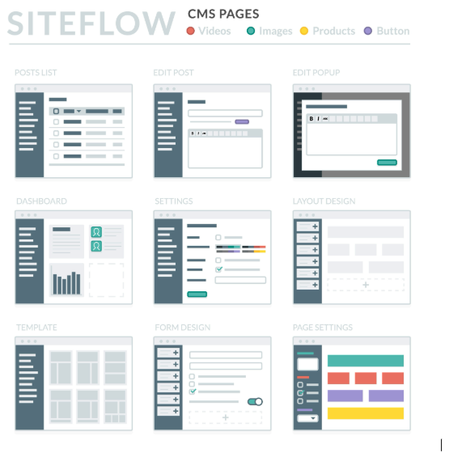

**### Mở rộng Kho công cụ (Toolbox Items) cho App Builder

Hiện tại bạn mới có các item cơ bản (Container, Button, Input...). Để chuyên nghiệp hơn, bạn nên bổ sung các nhóm sau:

#### A. Nhóm Layout & Structure (Cấu trúc)

* Grid / Row / Column: Để chia cột (2 cột, 3 cột) thay vì chỉ xếp dọc.

Shutterstock

* Divider: Đường kẻ ngang phân chia nội dung.
* Tabs: Chuyển đổi nội dung trong cùng một không gian.
* Modal / Popup: Cửa sổ bật lên.

#### B. Nhóm Form & Data Entry (Nhập liệu)

* Checkbox / Switch: Bật/tắt tùy chọn.
* Dropdown / Select: Chọn từ danh sách.
* Date Picker: Chọn ngày tháng (có thể tái sử dụng logic từ Calendar của bạn).
* Rich Text Editor: Nhập văn bản có định dạng.
* File Upload: Để user tải ảnh/tài liệu lên.

#### C. Nhóm Data Display (Hiển thị dữ liệu)

* Data Table / Grid: Hiển thị dữ liệu dạng bảng (cực kỳ quan trọng cho app quản lý).

Getty Images

* List View: Hiển thị danh sách lặp lại (giống như danh sách Todo của bạn).
* Chart: Biểu đồ cột/tròn (tích hợp thư viện như Recharts).
* Statistic Card: Thẻ thống kê số liệu (giống Dashboard của bạn).

---

### 3. Các tính năng "Chuyên nghiệp" cần bổ sung (Gợi ý nâng cao)

Để App Builder không chỉ là "kéo thả chơi", nó cần có "linh hồn" (Logic).

#### 1. Hệ thống Sự kiện (Event System) - Quan trọng nhất

* Mỗi component cần có tab "Events" trong Properties Panel.
* Ví dụ: Button có sự kiện onClick.
* User có thể chọn hành động: Maps to Page, Show Notification, Call API, hoặc Open Modal.

#### 2. Kết nối Dữ liệu (Data Binding)

* Thay vì nhập text tĩnh ("Click Me"), user có thể gõ {{user.name}}.
* App Builder cần một nơi quản lý "Biến toàn cục" (Global Variables) hoặc kết nối API để lấy dữ liệu động.

#### 3. Chế độ Preview (Xem trước)

* Nút "Preview" hiện tại của bạn chưa hoạt động.
* Cần làm chức năng: Khi bấm Preview, ẩn hết các khung nét đứt, ẩn Sidebar, và hiển thị ứng dụng như người dùng cuối sẽ thấy.

#### 4. Undo / Redo (Hoàn tác)

* Khi user lỡ tay xóa nhầm một Container chứa nhiều thứ, họ cần Ctrl+Z. Đây là tiêu chuẩn bắt buộc của các trình editor chuyên nghiệp.

#### 5. Responsive Design Mode

* Thêm thanh công cụ trên đầu Canvas để chuyển đổi view: Desktop, Tablet, Mobile. Canvas sẽ thay đổi chiều rộng tương ứng để user chỉnh sửa giao diện cho điện thoại.

**

**### Mở rộng Kho công cụ (Toolbox Items) cho App Builder

Hiện tại bạn mới có các item cơ bản (Container, Button, Input...). Để chuyên nghiệp hơn, bạn nên bổ sung các nhóm sau:

#### A. Nhóm Layout & Structure (Cấu trúc)

* Grid / Row / Column: Để chia cột (2 cột, 3 cột) thay vì chỉ xếp dọc.

Shutterstock

* Divider: Đường kẻ ngang phân chia nội dung.
* Tabs: Chuyển đổi nội dung trong cùng một không gian.
* Modal / Popup: Cửa sổ bật lên.

#### B. Nhóm Form & Data Entry (Nhập liệu)

* Checkbox / Switch: Bật/tắt tùy chọn.
* Dropdown / Select: Chọn từ danh sách.
* Date Picker: Chọn ngày tháng (có thể tái sử dụng logic từ Calendar của bạn).
* Rich Text Editor: Nhập văn bản có định dạng.
* File Upload: Để user tải ảnh/tài liệu lên.

#### C. Nhóm Data Display (Hiển thị dữ liệu)

* Data Table / Grid: Hiển thị dữ liệu dạng bảng (cực kỳ quan trọng cho app quản lý).

Getty Images

* List View: Hiển thị danh sách lặp lại (giống như danh sách Todo của bạn).
* Chart: Biểu đồ cột/tròn (tích hợp thư viện như Recharts).
* Statistic Card: Thẻ thống kê số liệu (giống Dashboard của bạn).

---

### 3. Các tính năng "Chuyên nghiệp" cần bổ sung (Gợi ý nâng cao)

Để App Builder không chỉ là "kéo thả chơi", nó cần có "linh hồn" (Logic).

#### 1. Hệ thống Sự kiện (Event System) - Quan trọng nhất

* Mỗi component cần có tab "Events" trong Properties Panel.
* Ví dụ: Button có sự kiện onClick.
* User có thể chọn hành động: Maps to Page, Show Notification, Call API, hoặc Open Modal.

#### 2. Kết nối Dữ liệu (Data Binding)

* Thay vì nhập text tĩnh ("Click Me"), user có thể gõ {{user.name}}.
* App Builder cần một nơi quản lý "Biến toàn cục" (Global Variables) hoặc kết nối API để lấy dữ liệu động.

#### 3. Chế độ Preview (Xem trước)

* Nút "Preview" hiện tại của bạn chưa hoạt động.
* Cần làm chức năng: Khi bấm Preview, ẩn hết các khung nét đứt, ẩn Sidebar, và hiển thị ứng dụng như người dùng cuối sẽ thấy.

#### 4. Undo / Redo (Hoàn tác)

* Khi user lỡ tay xóa nhầm một Container chứa nhiều thứ, họ cần Ctrl+Z. Đây là tiêu chuẩn bắt buộc của các trình editor chuyên nghiệp.

#### 5. Responsive Design Mode

* Thêm thanh công cụ trên đầu Canvas để chuyển đổi view: Desktop, Tablet, Mobile. Canvas sẽ thay đổi chiều rộng tương ứng để user chỉnh sửa giao diện cho điện thoại.

**

**### Mở rộng Kho công cụ (Toolbox Items) cho App Builder

Hiện tại bạn mới có các item cơ bản (Container, Button, Input...). Để chuyên nghiệp hơn, bạn nên bổ sung các nhóm sau:

#### A. Nhóm Layout & Structure (Cấu trúc)

* Grid / Row / Column: Để chia cột (2 cột, 3 cột) thay vì chỉ xếp dọc.

Shutterstock

* Divider: Đường kẻ ngang phân chia nội dung.
* Tabs: Chuyển đổi nội dung trong cùng một không gian.
* Modal / Popup: Cửa sổ bật lên.

#### B. Nhóm Form & Data Entry (Nhập liệu)

* Checkbox / Switch: Bật/tắt tùy chọn.
* Dropdown / Select: Chọn từ danh sách.
* Date Picker: Chọn ngày tháng (có thể tái sử dụng logic từ Calendar của bạn).
* Rich Text Editor: Nhập văn bản có định dạng.
* File Upload: Để user tải ảnh/tài liệu lên.

#### C. Nhóm Data Display (Hiển thị dữ liệu)

* Data Table / Grid: Hiển thị dữ liệu dạng bảng (cực kỳ quan trọng cho app quản lý).

Getty Images

* List View: Hiển thị danh sách lặp lại (giống như danh sách Todo của bạn).
* Chart: Biểu đồ cột/tròn (tích hợp thư viện như Recharts).
* Statistic Card: Thẻ thống kê số liệu (giống Dashboard của bạn).

---

### 3. Các tính năng "Chuyên nghiệp" cần bổ sung (Gợi ý nâng cao)

Để App Builder không chỉ là "kéo thả chơi", nó cần có "linh hồn" (Logic).

#### 1. Hệ thống Sự kiện (Event System) - Quan trọng nhất

* Mỗi component cần có tab "Events" trong Properties Panel.
* Ví dụ: Button có sự kiện onClick.
* User có thể chọn hành động: Maps to Page, Show Notification, Call API, hoặc Open Modal.

#### 2. Kết nối Dữ liệu (Data Binding)

* Thay vì nhập text tĩnh ("Click Me"), user có thể gõ {{user.name}}.
* App Builder cần một nơi quản lý "Biến toàn cục" (Global Variables) hoặc kết nối API để lấy dữ liệu động.

#### 3. Chế độ Preview (Xem trước)

* Nút "Preview" hiện tại của bạn chưa hoạt động.
* Cần làm chức năng: Khi bấm Preview, ẩn hết các khung nét đứt, ẩn Sidebar, và hiển thị ứng dụng như người dùng cuối sẽ thấy.

#### 4. Undo / Redo (Hoàn tác)

* Khi user lỡ tay xóa nhầm một Container chứa nhiều thứ, họ cần Ctrl+Z. Đây là tiêu chuẩn bắt buộc của các trình editor chuyên nghiệp.

#### 5. Responsive Design Mode

* Thêm thanh công cụ trên đầu Canvas để chuyển đổi view: Desktop, Tablet, Mobile. Canvas sẽ thay đổi chiều rộng tương ứng để user chỉnh sửa giao diện cho điện thoại.

**
